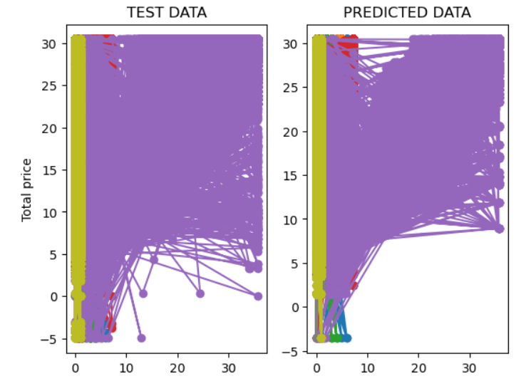

🚗 TripFare — Predicting Urban Taxi Fare with Machine Learning

A complete end-to-end Machine Learning project that analyzes real-world taxi trip records, builds regression models to estimate trip fares, and deploys a working prediction interface using Streamlit.

🧠 Skills You'll Gain

Exploratory Data Analysis (EDA)

Data Cleaning & Preprocessing

Feature Engineering

Data Visualization (Matplotlib, Seaborn)

Regression Model Building

Model Evaluation & Comparison

Hyperparameter Tuning

Streamlit Web App Deployment

Urban Transportation Analytics

🌍 Domain: Urban Transportation & Predictive Analytics
📣 Problem Statement

Urban transportation networks generate massive trip-level data. As a Data Analyst at an urban mobility analytics firm, your task is to analyze historical taxi trip records and build a machine learning model that predicts total taxi fare based on ride features such as distance, time, and trip metadata.

The final output is a Streamlit application where users enter trip-related details and instantly get a predicted taxi fare.

🎯 Real-World Applications

Ride-Hailing Apps → Fare prediction before booking

Driver Incentive Systems → Identify high-demand locations/times

Urban Mobility Insights → Analytics on fare patterns

Travel Budget Planning → Estimated costs for travelers

Shared-Ride Platforms → Dynamic pricing models

🧪 Problem Type

Supervised Machine Learning — Regression

Target Variable: total_amount

🔧 Project Workflow

1️⃣ Data Collection

Download the taxi dataset

Load using Pandas

2️⃣ Data Understanding

Check:

Shape & basic info

Datatypes

Missing values

Duplicate records

3️⃣ Feature Engineering

Derived meaningful columns to improve insights and model performance:

Feature	Description
trip_distance	Calculated using Haversine formula
pickup_day	Weekday / Weekend
am_pm	AM or PM category
is_night	Binary flag for late-night trips
pickup_datetime_local	Converted from UTC → EDT

Additional engineered features help analyze fare trends and improve prediction accuracy.

4️⃣ Exploratory Data Analysis (EDA)

Performed both univariate and bivariate analysis:

Key analyses:

Fare vs Distance

Fare vs Passenger Count

Outlier detection (fare, distance, duration)

Fare trends across:

Hours

Weekdays vs Weekends

Months

Visualizations include:

Distribution plots

Boxplots

Heatmaps

Time-based demand patterns

5️⃣ Data Transformation

Outlier handling → IQR or Z-score

Skewness transformation → log/sqrt

Encoding categorical variables

6️⃣ Feature Selection

Applied multiple techniques:

Correlation Matrix

Chi-Square Test

RandomForest Feature Importance

Model-based selection

7️⃣ Model Building

Built and evaluated minimum 5 regression models:

Linear Regression

Ridge Regression

Lasso Regression

Random Forest Regressor

Gradient Boosting Regressor

📊 Evaluation Metrics

R²

MAE

MSE

RMSE

8️⃣ Hyperparameter Tuning

Used GridSearchCV / RandomizedSearchCV for the best-performing model.

9️⃣ Finalizing the Best Model

Model saved in Pickle / Joblib format

Loaded inside Streamlit app

🔟 Streamlit UI (Final Deployment)

Built a user-friendly interface where users input:

Pickup latitude/longitude

Dropoff latitude/longitude

Passenger count

Time of travel

Any other engineered features

App displays:

👉 Predicted Total Fare Amount

🎉 Project Outcome

✔ Cleaned and analyzed a real-world transportation dataset
✔ Engineered new features for deeper insights
✔ Built, compared, and tuned multiple ML regression models
✔ Selected best-performing fare prediction model
✔ Deployed a functional Streamlit application

📈 Evaluations:

The evaluation metrics and results for the taxi fare prediction model are as follows:

Mean Absolute Error 0.81

Mean Squeared Error 2.33

R2 Score For Train Data 0.96

R2 Score For Test Data 0.95

